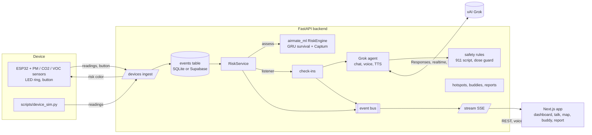
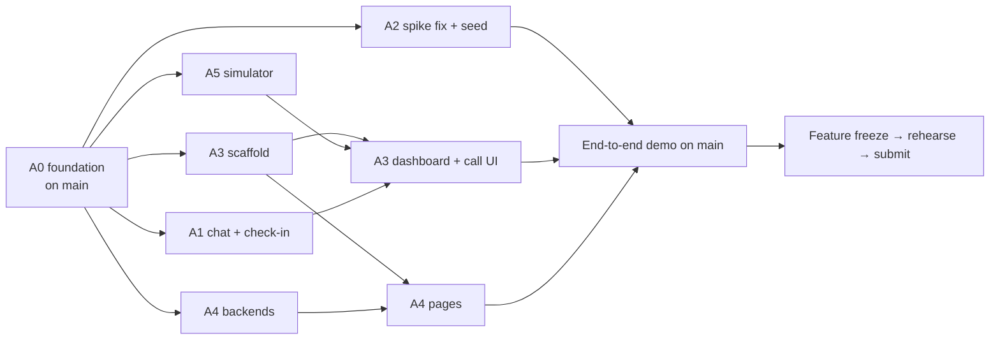

# Airmate

**An early warning for asthma, from the air in your own room.** A small ESP32 device measures dust,
fine particles, chemical odors, CO₂, temperature and humidity. A PyTorch model turns the last few
hours into the chance you'll need your rescue inhaler in the next 1, 4 and 12 hours, and explains
why ("Dust is 7× your normal"). When risk jumps, Airmate, a Grok voice agent, calls you, walks
you through *your own* action plan, and, if you describe an emergency, tells you to call 911 and
alerts your asthma buddy. A community map shows anonymized air hotspots, and a one-page report
gives your doctor the month at a glance.

Built at HackGT 13.

> **Honesty note.** No public dataset pairs home air readings with inhaler use, so the risk model is
> trained and evaluated **only on simulated people** (see [ml/MODEL_CARD.md](ml/MODEL_CARD.md)).
> Airmate is a support tool, not a medical device.

## The demo in one breath

Maya's dashboard is calm (score ~5, green) → she wipes a shelf with a dusty cloth next to the device →
PM10 jumps to 7× her normal → the score jumps and the device ring turns amber → **Airmate calls her**:
"Dust in your room just jumped; how's your breathing?" → "a bit wheezy" → Airmate reads her yellow-zone
steps from her action plan → "my inhaler isn't helping" → fixed 911 script, and **Jordan's phone lights
up** with her location → community map and doctor report. Full script: `docs/DEMO.md` (A2).

## Architecture



| Path | What | State |
|---|---|---|
| `ml/` | Cohort simulator, `AirmateRiskNet` (PyTorch), Captum explanations, serving engine, rule fallback | ✅ done, one failing test (see Known issues) |
| `backend/` | FastAPI: ingest, risk, SSE, Grok agent, safety, community, buddy, report | 🟡 foundation runs; features stubbed (501) |
| `web/` | Next.js static export served by the backend | ⬜ not started (A3) |
| `firmware/` | ESP32 PlatformIO firmware | ⬜ not started (A5) |
| `scripts/device_sim.py` | Device simulator with the demo scenarios | ⬜ not started (A5) |
| `docs/` | `API.md` contract; later `DEMO.md`, `DEVPOST.md`, `FACTS.md`, `HARDWARE.md` | 🟡 |
| `agents/` | One brief per agent | ✅ |

## Run it

```bash
export PATH="$HOME/.local/bin:$PATH"
cp .env.example .env            # optional: add XAI_API_KEY etc.; everything works without keys
uv sync
uv run pytest                   # ml + backend tests
uv run airmate-api              # http://localhost:8000/docs  (serves web/out at / once it's built)

# retrain the model (~3 min on CPU)
uv run airmate-train

# web app (once A3's scaffold lands)
cd web && npm install && npm run dev     # with NEXT_PUBLIC_API_URL=http://localhost:8000 in web/.env.local
npm run build                            # static export to web/out, served by the backend

# fake device (once A5's simulator lands)
uv run python scripts/device_sim.py --scenario dust
```

Try the core loop by hand:
```bash
curl -X POST localhost:8000/api/devices/airmate-01/readings -H 'content-type: application/json' \
  -d '{"readings":[{"pm25":8,"pm10":180,"co2":700,"tvoc":130,"temp_c":22,"humidity":46}]}'
curl localhost:8000/api/users/maya/risk
curl -N 'localhost:8000/api/stream?user_id=maya'
```

## The plan

Six agents work in parallel on separate branches, each owning separate files. The rules are in
[AGENTS.md](AGENTS.md), the contract in [docs/API.md](docs/API.md), and each agent's tasks in `agents/`.

| Id | Agent | Workstream | Delivers |
|---|---|---|---|
| A0 | Claude (main) | [Lead](agents/A0-lead.md) | Foundation, contracts, reviews/merges, integration, deployment, final README |
| A1 | Claude #2 | [agent-voice](agents/A1-agent-voice.md) | Grok chat with tools, TTS, realtime voice, check-in "calls" (jump + threshold), emergency flow, buddy nudges, ntfy |
| A2 | Claude #3 | [ml-demo](agents/A2-ml-demo.md) | Fix the dust-spike response and retrain, outdoor data, a week of demo history, `DEMO.md`, `FACTS.md`, `DEVPOST.md` |
| A3 | Gemini #1 | [web-core](agents/A3-web-core.md) | Next.js scaffold + shared client, dashboard, check-in call overlay, emergency screen, talk, settings |
| A4 | Gemini #2 | [community-care](agents/A4-community-care.md) | Hotspot map (backend + page), buddy matching + buddy phone, doctor report (backend + page) |
| A5 | Codex | [device](agents/A5-device.md) | Device simulator (first), ESP32 firmware, `HARDWARE.md` |

### Critical path



Fill in the deadline and count backwards:

| When | Checkpoint |
|---|---|
| T+0:45 | A3 scaffold merged (unblocks A4 pages). A5 simulator merged (unblocks everyone's testing). |
| T+3h | A1 chat (template mode) + check-in trigger merged. A4 backends merged with tests. A2 seed merged. |
| T+5h | A2 retrained model merged (failing test fixed honestly). Dashboard + call overlay live. |
| T+7h | **End-to-end demo works on `main`** with the simulator and no API keys. |
| Deadline − 6h | Feature freeze: only bug fixes and polish after this. Real hardware integrated or dropped. |
| Deadline − 3h | Code freeze. Record the demo video; three full rehearsals from `docs/DEMO.md`. |
| Deadline − 1h | Devpost submitted (A2 draft, A0 final). |

## Known issues and open items

* **Failing test:** `ml/tests/test_engine.py::test_trained_model_reacts_to_a_dust_spike`. A 24-minute
  dust spike moves the score only ~3 → 7 (the simulator implies ~25), and scores usually sit in single
  digits, so a fixed threshold of 45 would never call. Two fixes run in parallel: A2 retrains so the
  model responds to short spikes; A1 also triggers check-ins on a sudden jump
  (`CHECKIN_JUMP_POINTS`, default 12 points within 30 min).
* **Unverified xAI model ids and endpoints** in `backend/airmate_api/config.py` (`grok-4.3`,
  `grok-4.7`, `grok-voice-latest`, `/tts`, realtime URL). A1 checks them against docs.x.ai.
* **CDC statistics** (27.8 M people with asthma in the US, about 1 in 12; 4.8 M children; 3,624
  deaths in 2023) were read from an archived copy. A2 verifies them on the live CDC page before they
  go in the pitch (`docs/FACTS.md`).
* **Commit timestamps** on the first three commits are all within one second (they were committed in
  one batch), so they show when the code was committed, not when it was written. From here on, small
  frequent PRs give an honest build timeline.

## Progress

| Workstream | State |
|---|---|
| A0 foundation | ✅ backend runs, contracts and briefs written |
| A1 agent-voice | ⬜ |
| A2 ml-demo | ⬜ |
| A3 web-core | ⬜ |
| A4 community-care | ⬜ |
| A5 device | ⬜ |
