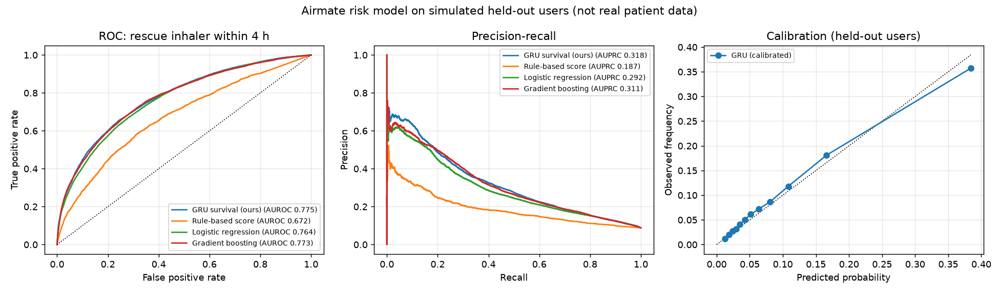

# Model card: Airmate risk model

> Trained and evaluated **only on simulated data**. There is no public dataset that pairs home
> air-quality streams with inhaler use, so these numbers show the pipeline works end to end.
> They are not evidence of clinical accuracy. Airmate is an early-warning and support tool, not a medical device.

## What it predicts

The probability that the person will need their rescue inhaler within the next 1, 4, and 12 hours.
The 0-100 risk score in the app is the calibrated 4-hour probability × 100.

## Inputs

* **Sensor stream** (last 3 h at 3-minute resolution): PM2.5, coarse dust (PM10 − PM2.5), CO₂, TVOC,
  temperature, humidity, each particle/VOC channel relative to the person's own 24 h baseline, plus
  availability masks, so the model works with whichever sensors are attached.
* **Context:** time of day, outdoor AQI and pollen forecast, outdoor weather, rescue puffs in the last
  6 h / 24 h / 7 days, hours since last puff, logged symptoms, 24 h exposure summaries, personal
  baselines, and self-reported triggers.

## Architecture

`AirmateRiskNet` (PyTorch, 52,804 parameters): context MLP → FiLM modulation of the sensor
sequence → GRU → attention pooling → discrete-time survival head with one conditional hazard per
interval (0-1 h, 1-4 h, 4-12 h). Cumulative risk is monotone across horizons by construction.
Trained with the survival negative log-likelihood (censoring handled), AdamW with a one-cycle
learning-rate schedule, early stopping on validation loss, then per-interval Platt calibration.

## Data

`airmate_ml.simulate` generates 1200 people × 10 days. Each person has hidden trigger
sensitivities, a home with its own ventilation, cooking, cleaning, candles, sprays, pets, humidity,
and heating, a daily schedule, and seasonal outdoor pollen, smoke episodes, and weather.
Flares follow a hazard process with fast-attack/slow-release acute effects, an allergen late-phase
response, day-scale inflammation, a night-time peak, and rescue-inhaler protection. Readings get
sensor noise, missing sensors, and offline gaps. People are split by person (train 840,
validation 180, test 180), so the test set is people the model never saw.

## Results on held-out simulated people (4-hour horizon)

| Model | AUROC | AUPRC | Brier | ECE |
|---|---|---|---|---|
| GRU survival model (ours) | 0.775 | 0.318 | 0.0701 | 0.0071 |
| Gradient boosting (scikit-learn) | 0.773 | 0.311 | 0.0706 | 0.0136 |
| Logistic regression (scikit-learn) | 0.764 | 0.292 | 0.0715 | 0.0054 |
| Rule-based score | 0.672 | 0.187 | n/a | n/a |
| Oracle: the simulator's hidden current flare rate (reference) | 0.752 | 0.347 | n/a | n/a |

The oracle ranks each moment by the simulator's hidden *current* flare rate, which no real model can see.
It is a reference point, not a ceiling: the model can beat it because it also anticipates what usually
happens next (dinner-time cooking, night-time peaks) and learns the logging habits behind the labels.

GRU by horizon:

| Horizon | AUROC | AUPRC | Brier | Base rate | Mean predicted |
|---|---|---|---|---|---|
| 1h | 0.797 | 0.147 | 0.0228 | 0.025 | 0.025 |
| 4h | 0.775 | 0.318 | 0.0701 | 0.088 | 0.085 |
| 12h | 0.751 | 0.504 | 0.1452 | 0.222 | 0.204 |

## Explanations

Captum Shapley value sampling splits each score into contributions from dust, fine particles,
VOCs, CO₂, humidity, cold air, pollen, outdoor AQI, weather, inhaler use, symptoms, and time of day,
relative to a "normal day" reference built from the person's own baselines. On 1500 high-risk
test moments, the top trigger group matched the simulator's hidden dominant trigger
**56%** of the time (always guessing the most common trigger: 42%).
Recall by trigger: dust 45%, smoke 37%, pollen 73%, humidity 55%, odors 49%, cold air 54%.

## Limitations

* Simulated data encodes our assumptions about asthma; real people will differ.
* The label is "rescue inhaler used", which in real life is affected by adherence and logging.
* Exposure away from home is invisible to a home sensor.
* A real deployment would need prospective validation with clinicians, consent, and HIPAA-compliant handling.
